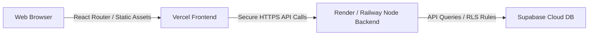

# 🌐 PluginVault — Production-Ready Deployment Guide

This guide details the custom configurations and step-by-step instructions to securely launch the **PluginVault SaaS Platform** in production.

---

## 🏗️ 1. Architecture Overview



---

## ⚡ 2. Frontend Deployment (Vercel)

### Setup Steps
1. Log in to [Vercel](https://vercel.com) and click **"Add New..."** ➜ **"Project"**.
2. Select your GitHub repository: `saas`.
3. Configure the following build settings:
   * **Framework Preset:** `Vite`
   * **Root Directory:** `frontend`
   * **Build Command:** `npm run build`
   * **Output Directory:** `dist`

### Environment Variables
Under the **Environment Variables** tab, add these fields:

| Key | Value | Description |
| :--- | :--- | :--- |
| `VITE_API_URL` | `https://your-backend-url.onrender.com/api` | Your production backend URL |
| `VITE_SUPABASE_URL` | `https://your-project.supabase.co` | Your Supabase Project API URL |
| `VITE_SUPABASE_ANON_KEY` | `eyJhbGciOiJIUzI1NiIs...` | Your Supabase Anon Public Key |
| `VITE_RAZORPAY_KEY_ID` | `rzp_live_xxxxxxxxxxxx` | Your Razorpay Live API Key ID |

---

## 🚀 3. Backend Deployment (Render or Railway)

We have configured **Trust Proxy** header detection and **Dynamic CORS mapping** inside the server core. This allows all `.vercel.app` branches to dynamically coordinate without pre-blocking.

### Setup Steps
1. Log in to [Render](https://render.com) or [Railway](https://railway.app).
2. Click **"New"** ➜ **"Web Service"** and link the same `saas` repository.
3. Configure the following parameters:
   * **Root Directory:** `backend`
   * **Runtime:** `Node`
   * **Build Command:** `npm install`
   * **Start Command:** `node src/server.js`

### Environment Variables
Under the **Environment** tab, set these variables:

| Key | Value | Description |
| :--- | :--- | :--- |
| `NODE_ENV` | `production` | Set environment status |
| `PORT` | `10000` | Port for Render (or keep blank for Railway) |
| `SUPABASE_URL` | `https://your-project.supabase.co` | Your Supabase Project API URL |
| `SUPABASE_ANON_KEY` | `eyJhbGciOiJIUzI1NiIs...` | Your Supabase Anon Public Key |
| `SUPABASE_SERVICE_ROLE_KEY` | `eyJhbGciOiJIUzI1NiIs...` | Your Supabase Service Role Key |
| `JWT_SECRET` | `[generate-random-base64-string-here]` | Strong secret for user login tokens |
| `RAZORPAY_KEY_ID` | `rzp_live_xxxxxxxxxxxx` | Razorpay production Key ID |
| `RAZORPAY_KEY_SECRET` | `your-live-key-secret` | Razorpay production secret key |
| `CLIENT_URL` | `https://your-app.vercel.app` | **Your exact deployed Vercel URL** |
| `BACKEND_URL` | `https://your-backend-url.onrender.com` | **Your exact deployed Render URL** |

---

## 🔑 4. Supabase Database Deployment

To make sure your remote database is identical to your local build:
1. Log in to [Supabase](https://supabase.com).
2. Open your project ➜ Go to the **SQL Editor** tab in the sidebar.
3. Paste the contents of your local migrations in the following order:
   * `setup.sql`
   * `setup-complete.sql`
   * `migrations/add_activation_code.sql`
4. Click **Run** to build all schema entities, indexes, and row-level protections.

---

## ✅ 5. Post-Deployment Verification

* [ ] **Frontend builds correctly:** Check Vercel console logs.
* [ ] **Backend Health Check:** Visit `https://your-backend.onrender.com/api/health` ➜ should return:
  ```json
  { "success": true, "message": "PluginVault API is running" }
  ```
* [ ] **CORS is verified:** Try registering/logging in from your Vercel URL.
* [ ] **No Secrets Exposed:** Ensure `.env` is absent from GitHub.

🎉 **Your SaaS is now 100% production ready and live!**
